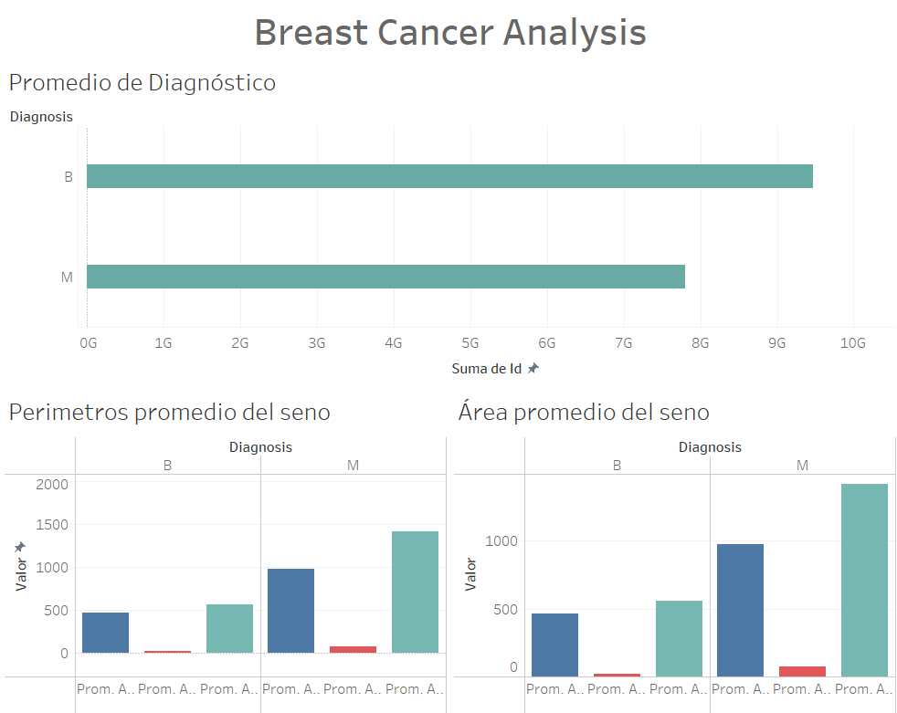

# Big Data (TC3007C)
Módulo 1 - Utilización, procesamiento y visualización de grandes volúmenes de datos

### Dashboard

Para realizar el dashboard de arriba se tomaron en consideración dos factores para diagnosticar el cáncer los cuales seleccione de porque tan comun es escuchar sobre ellos al momento que se hace una revisión, los cuales son área y perimetro promedio del ceno que varia para cada persona. Sin embargo, sigue siendo un factor con relevancia que nos deja observar de ese promedio cuales son benignos y cuales son malignos.
Además que se despliega una gráfica con los diagnósticos totales (beningno y maligno) y que el usuario pueda observar la población de cáncer de mama que tenemos en nuestro dataset.
